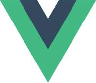

# Jngo's GitHub Profile

Hello, and welcome to my GitHub profile! Here you can find the open source repositories for a variety of my projects. I'm a U.S.-based software engineer professionally and a game developer hobbyist.

## My Top Skills

<a href="https://github.com/jngo102?tab=repositories&q=&type=&language=vue&sort=stargazers"> Vue.js</a>

<a href="https://github.com/jngo102?tab=repositories&q=&type=&language=typescript&sort=stargazers"> TypeScript</a>

<a href="https://unity.com/"> Unity Engine</a>

<a href="https://github.com/jngo102?tab=repositories&q=&type=&language=C%23&sort=stargazers"> .NET</a>

<a href="https://github.com/jngo102?tab=repositories&q=&type=&language=gdscript&sort=stargazers"> Godot Engine</a>
